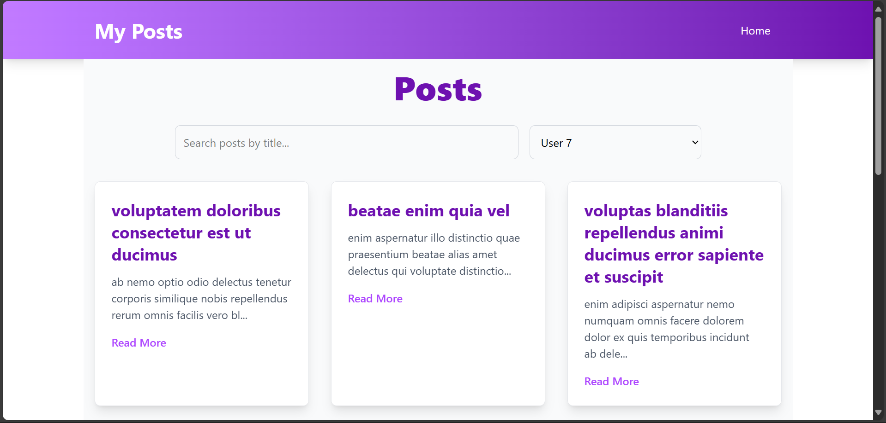
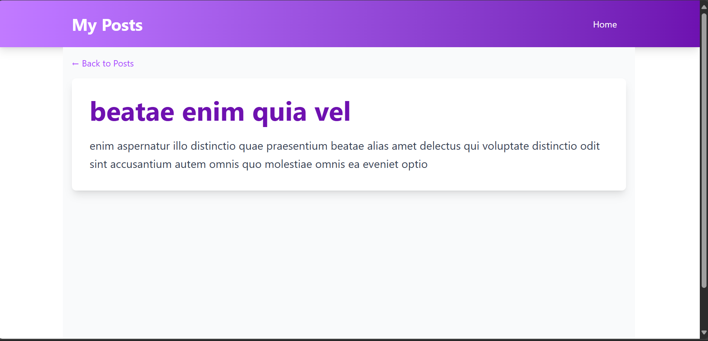

# My Posts

A React.js application that fetches posts from the JSONPlaceholder API and displays them in a custom-themed UI built with Tailwind CSS. The application includes search and filter functionalities, routing for detailed post views, and a responsive design.

## Table of Contents
- [Features](#features)
- [Installation](#installation)
- [Usage](#usage)
- [Screenshots](#screenshots)
- [Repository](#repository)
- [Deployment](#deployment)
- [Technologies Used](#technologies-used)
- [Contributing](#contributing)
- [License](#license)

## Features

- **API Integration:** Fetches posts from [JSONPlaceholder](https://jsonplaceholder.typicode.com/posts).
- **Routing:** Implemented using `react-router-dom`:
  - Home page (`/`) displays a list of posts.
  - Post detail page (`/post/:id`) shows detailed post information.
- **Search & Filter:** 
  - Search posts by title.
  - Filter posts by user ID.
- **Custom Theming:** Styled header, footer, and loader components with a modern UI.
- **Responsive UI:** Optimized for mobile and desktop devices.
- **Smooth Animations:** Transitions and hover effects for an enhanced user experience.

## Installation

1. **Clone the repository:**

   ```bash
   git clone https://github.com/Deepak-Varshney/react-api.git
   ```

2. **Navigate to the project directory:**

   ```bash
   cd react-api
   ```

3. **Install dependencies:**

   ```bash
   npm install
   ```

4. **Start the development server:**

   ```bash
   npm run dev
   ```

## Usage

Once the development server is running, open your browser and navigate to `http://localhost:3000` to view the application.

## Screenshots


- **Home Page:**
  
  

- **Post Detail Page:**
  
  

## Repository

You can view the source code and contribute to this project on GitHub:  
[Deepak-Varshney/react-api](https://github.com/Deepak-Varshney/react-api)

## Deployment

This is the live link for this project 
[visit here](https://react-api-plum.vercel.app/)

## Technologies Used

- [React.js](https://reactjs.org/)
- [React Router DOM](https://reactrouter.com/)
- [Tailwind CSS](https://tailwindcss.com/)
- [Vite](https://vitejs.dev/) *(or Create React App)*
- [JSONPlaceholder API](https://jsonplaceholder.typicode.com/)

## Contributing

Contributions are welcome! Please fork the repository and submit a pull request for any improvements or fixes.

## License

This project is licensed under the [MIT License](LICENSE).